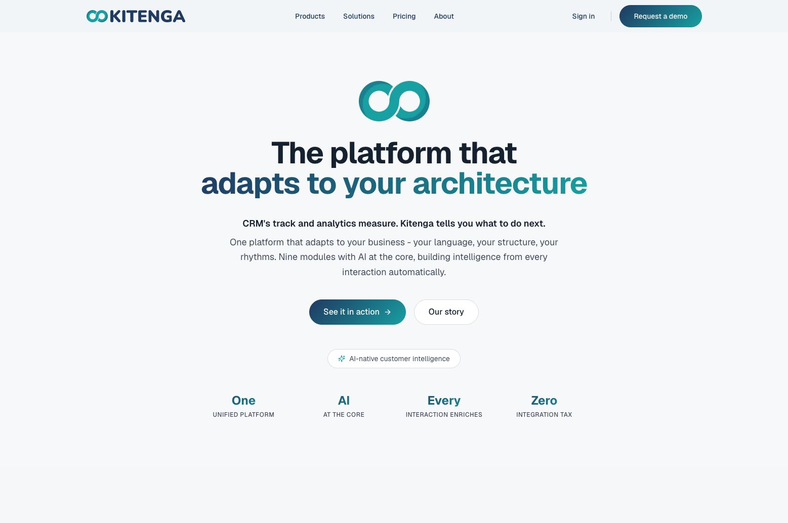
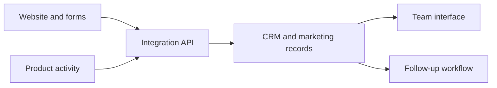

# Kitenga
## CRM and marketing workflows, designed and built hands-on

**Contribution:** Product design and development  
**Product:** [kitenga.app](https://kitenga.app)

*Public product website; no customer CRM records are shown.*

## The problem

A CRM needs to connect what happens on a website with the information a business uses to understand enquiries and take the next step. The interface, records and integrations need a consistent understanding of that activity.

## My contribution

I personally designed and built Kitenga, a CRM and marketing platform. The work combined product design with hands-on implementation, giving me familiarity with the general CRM architecture and how data needs to move between systems.

## A representative data flow

This is a conceptual explanation, not a claim that every customer's setup follows this exact path.

An integration client used alongside Teacher's Buddy covers capabilities such as form submissions, page views and conversions, product-event ingestion, identity merging and booking. Those interfaces make the connection between product activity and marketing workflows concrete.

## Engineering considerations

- **Data contracts:** define what each event or form submission means before connecting systems.
- **Identity:** make explicit how activity relates to a person or organisation.
- **Application boundaries:** keep integration credentials on the server and expose only the operations the interface needs.
- **Usable workflows:** make the data useful to the person who needs to review or act on it.

These are also the questions I bring to a new CRM integration: where the information starts, how it is validated, what record it belongs to and what should happen next.

## Relevance to contract work

CRM integrations, enquiry capture, form-to-CRM flows, marketing automation and practical AI additions to existing business processes.

This case study concerns Kitenga. It does not imply Salesforce or HubSpot certifications or platform-specific project experience.

For a small public code example, see [Enquiry Desk](https://github.com/tbmattnz/ai-enquiry-crm): an enquiry-to-CRM demonstration with human review, contact matching and safe retries.

