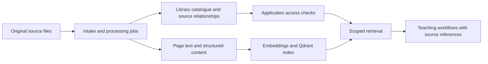

# Teacher’s Buddy library
## From source documents to searchable, traceable content

**My contribution:** Hands-on product design, architecture and implementation. I personally designed and built Teacher’s Buddy, including the library and content-processing workflows described here.

**[Explore the runnable search sample](https://tbmattnz.github.io/library-search/)** · **[Inspect its code and tests](https://github.com/tbmattnz/library-search)**

The sample is original standalone code using fictional holdings and public-domain excerpts. It demonstrates selected retrieval and provenance principles; it is not the commercial library application.

## The problem

A document collection becomes useful when people can find the relevant material, understand where it came from and use it in the right context. For Teacher’s Buddy, this also means connecting publisher material with teaching workflows and respecting access to licensed content.

The work spans the product experience and the processing behind it: receiving source files, organising their contents, retrieving relevant passages and preserving links back to the source.

## What I designed and built

- **Document intake and processing:** workflows for original source files and segmented material, including OCR-enabled text extraction and page-level text units.
- **Content organisation:** relationships between publishers, library packages, resources and source segments, with processing status and failure handling.
- **Searchable content:** Qdrant-based semantic indexing and retrieval, carrying resource, publisher and library-package metadata alongside text.
- **Source references:** page, section and other location metadata retained with indexed content so downstream workflows can associate retrieved material with its origin.
- **Licensed-content workflows:** title and source access checks, with publisher and citation information available to the application.

## Simplified architecture

This explains responsibilities rather than deployment configuration. The commercial implementation uses TypeScript, background processing, relational data and Qdrant. It includes external model/provider integrations; this case study does not claim a fully on-premise deployment.

## Decisions that matter

**Preserve source identity through processing.** Original files, derived segments and retrieved passages need explicit relationships. A useful search result should retain enough location information to resolve it to its source. Page references belong in the data pipeline, not just the final display.

**Keep catalogue data and extracted content connected.** Catalogue metadata describes the resource; extracted content supports passage-level retrieval. Explicit identifiers make those relationships inspectable and avoid relying on a title match to decide whether two records are the same thing.

**Separate access decisions from relevance ranking.** An item can be relevant without being available to a particular user. Application access checks and scoped retrieval serve different purposes. A similarity score is not permission to use licensed content.

**Treat processing as a recoverable workflow.** Large files and source bundles introduce partial completion and failures. Processing state should show which segments succeeded and which require attention, with source relationships retained throughout.

**Retain citations without treating them as proof of correctness.** Source references make verification possible. They do not, by themselves, establish that a generated answer is supported. Retrieval evaluation and checks of generated claims remain separate concerns.

## A focused public demonstration

[Library Search](https://github.com/tbmattnz/library-search) uses two differently shaped catalogue fixtures and a separate digital repository. It demonstrates:

1. Normalising records while retaining their source identifiers.
2. Joining catalogue entries to digital excerpts by explicit IDs.
3. Searching metadata and text, then opening the exact matching demo page.
4. Retaining catalogue-only records and reporting broken digital links.
5. Updating availability independently of the text index.

The demonstration uses lexical BM25 retrieval, not the commercial system’s embeddings or Qdrant. It has no LLM, paid API or generated answers. Its fixture pagination is clearly labelled and does not represent printed-edition page numbers.

## Relevance to a library integration project

This work is relevant to ingestion, catalogue-to-content relationships, retrieval, provenance, access controls and the operational shape of a document pipeline. It provides hands-on context for reviewing an architecture and breaking implementation into concrete work packages.

Specific legacy library interfaces, multilingual quality and on-premise hardware sizing need their own discovery and evaluation. This case study does not claim experience deploying Sierra, DSpace, Greenstone, MARC21, Z39.50 or OAI-PMH connectors, nor performance benchmarks for a 400,000-record collection.

Commercial source and customer data remain private. No throughput, accuracy or commercial-impact metric is claimed here without a measured result.

[Teacher’s Buddy overview](teachers-buddy.md) · [Other product work](README.md)
