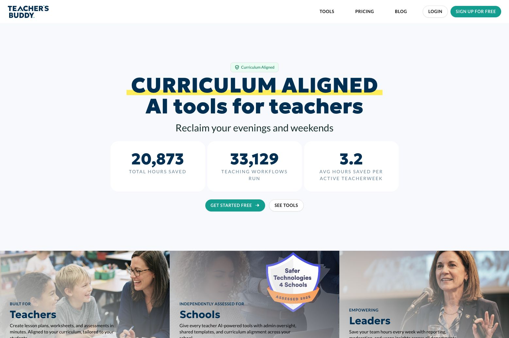
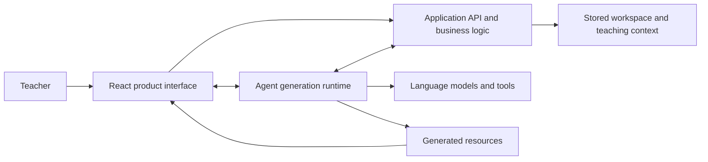

# Teacher's Buddy
## Turning teaching context into useful AI workflows

**Role:** Product & Development Lead  
**Contribution:** Hands-on product design and development  
**Product:** [teachersbuddy.com](https://www.teachersbuddy.com)

*Public product website; not a screenshot of a customer's workspace.*

## The problem

Generating a piece of teaching content is only part of the job. A useful product needs to connect the teacher's workspace, curriculum, learner groups and available resources to the task they are trying to complete.

## What I designed and built

I personally designed and built Teacher's Buddy. Two representative parts of that work are:

- **The teaching-resource workflow:** workspace context, curriculum alignment, learner groups, publisher resources, tools and templates working together to support resource creation.
- **The instructional coach:** an AI coaching workflow for teachers, including the product experience and its implementation.

My contribution covers the interface and the application behind it: structuring workflows, connecting APIs and data, and implementing AI capabilities inside a usable product.

## Simplified architecture

The active application uses a React/Vite frontend, a Hono/tRPC API, shared business services and Prisma-backed data access. Agent generation runs in a separate Cloudflare Workers runtime.

The diagram deliberately omits infrastructure and individual service details; it explains responsibilities rather than serving as a deployment map.

## Implementation decisions that matter

**Context belongs to the workflow.** Workspace, curriculum and learner information should inform what the teacher creates, with templates giving the result a useful structure.

**AI is part of the application.** Model calls need to connect to the product's tools, APIs and data rather than ending at an isolated chat response.

**The interface and backend have to agree.** Designing and implementing both sides helps keep the user journey aligned with the underlying data flow.

## Relevance to contract work

This experience transfers to AI-assisted business tools, document and content workflows, API integration, and improvements to an existing product interface.

The commercial source remains private. [Enquiry Desk](https://github.com/tbmattnz/ai-enquiry-crm) provides a separate public example of my approach to a small AI-assisted workflow.

